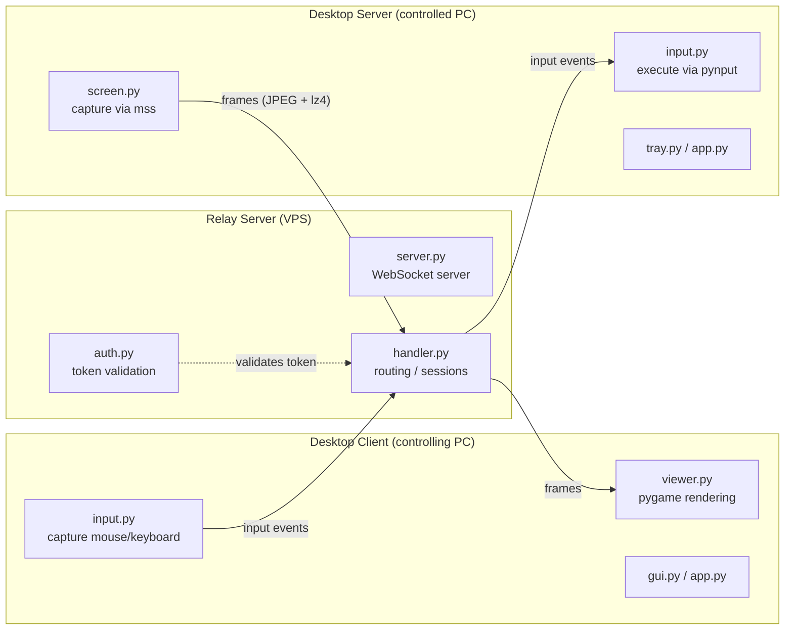
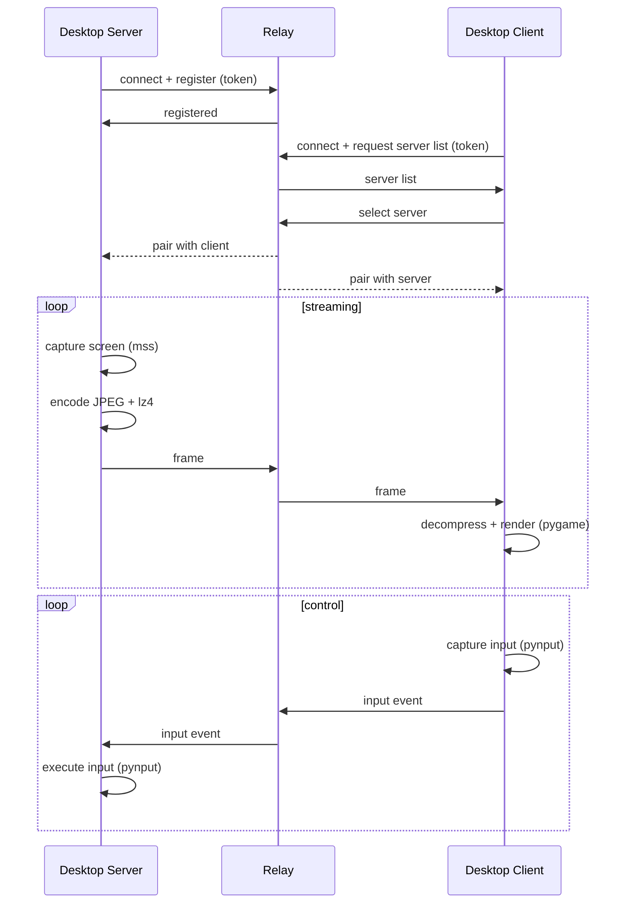

<div align="center">


[](LICENSE)

[](https://www.python.org)

[](#)

</div>

> Open-source remote desktop for Windows that routes screen and input over a WebSocket relay server.

remote-desk is a three-tier remote access tool: a desktop **server** captures the screen and executes incoming input, a desktop **client** displays the stream and captures local mouse/keyboard, and a lightweight **relay** server brokers traffic between them so connections work across NAT and over the internet. This repository is an early-stage scaffold: the project structure, module layout, dependencies, and architecture are in place, while the Python modules are currently skeleton files awaiting implementation (see [STATUS.md](STATUS.md)).

## Table of Contents

- [Features](#features)
- [Architecture](#architecture)
- [Requirements](#requirements)
- [Installation](#installation)
- [Usage](#usage)
- [Project structure](#project-structure)
- [License](#license)

## Features

- View a remote Windows desktop and control its mouse and keyboard.
- Relay-based connectivity for NAT traversal over the internet (client and server connect outbound to a shared relay).
- Screen capture via `mss` (no administrator privileges required).
- Frame encoding with Pillow (JPEG) and additional `lz4` compression.
- Frame rendering on the client with `pygame`.
- Remote input capture and execution with `pynput`.
- System tray integration on the server via `pystray`.
- Token-based authentication validated at the relay, with TLS intended for production deployments.
- JSON configuration via `desktop/config.example.json` (relay URL, token, capture FPS, quality, scale, monitor selection, client hotkeys).
- PyInstaller build scripts for producing standalone executables.

> Note: modules are scaffolded but not yet implemented. The features above describe the intended, documented design as reflected in the module layout, requirements, and `docs/ARCHITECTURE.md`.

## Architecture

The system has three components. The desktop **server** runs on the machine being controlled, the desktop **client** runs on the controlling machine, and the **relay** routes messages between them over WebSockets.



A typical session, following the connection and streaming flow described in `docs/ARCHITECTURE.md`:



Shared concerns live in `desktop/common/`: the wire `protocol`, `connection` management, `compression`, and `config` loading.

## Requirements

- Python 3.10+
- Windows 10/11 for the desktop client and server
- A Linux VPS (recommended) for the relay server

Desktop dependencies (`desktop/requirements.txt`): `websockets`, `mss`, `Pillow`, `pynput`, `lz4`, `pygame`, `pystray`, `pyinstaller`.

Relay dependencies (`relay/requirements.txt`): `websockets`.

## Installation

```powershell
# Clone the repository
git clone https://github.com/fabricioguidine/remote-desk.git
Set-Location remote-desk

# Create and activate a virtual environment
python -m venv venv
.\venv\Scripts\Activate.ps1

# Install desktop dependencies (client and server)
pip install -r desktop\requirements.txt
```

On the relay host (Linux VPS):

```bash
pip install -r relay/requirements.txt
```

To configure a desktop install, copy the example config and edit it:

```powershell
Copy-Item desktop\config.example.json desktop\config.json
```

## Usage

Run the relay on the VPS:

```bash
python -m relay.server
```

Run the server on the Windows PC to be controlled:

```powershell
python -m desktop.server.main
```

Run the client on the Windows PC that controls:

```powershell
python -m desktop.client.main
```

Build standalone executables with PyInstaller:

```powershell
python scripts\build_server.py
python scripts\build_client.py
python scripts\build_relay.py
```

## Project structure

```
remote-desk/
├── relay/                  # WebSocket relay server (VPS)
│   ├── server.py           # WebSocket server, routes connections
│   ├── handler.py          # Message routing and session management
│   ├── auth.py             # Token validation
│   └── config.py           # Relay configuration
├── desktop/
│   ├── client/             # Controlling-side viewer and input capture
│   │   ├── main.py         # Client entry point
│   │   ├── app.py          # Client application logic
│   │   ├── viewer.py       # Screen display (pygame)
│   │   ├── input.py        # Mouse/keyboard capture
│   │   └── gui.py          # Client GUI
│   ├── server/             # Controlled-side capture and input execution
│   │   ├── main.py         # Server entry point
│   │   ├── app.py          # Server application logic
│   │   ├── screen.py       # Screen capture (mss)
│   │   ├── input.py        # Input execution (pynput)
│   │   ├── tray.py         # System tray icon (pystray)
│   │   └── gui.py          # Server GUI
│   ├── common/             # Shared modules
│   │   ├── protocol.py     # Message classes and serialization
│   │   ├── connection.py   # WebSocket connection management
│   │   ├── compression.py  # LZ4 compression utilities
│   │   └── config.py       # Configuration loading
│   └── config.example.json # Example configuration
├── scripts/                # PyInstaller build and cert generation scripts
├── tests/                  # Unit tests (protocol, connection, compression)
└── docs/                   # Architecture, setup, and usage documentation
```

## License

Released under the [MIT License](LICENSE).
