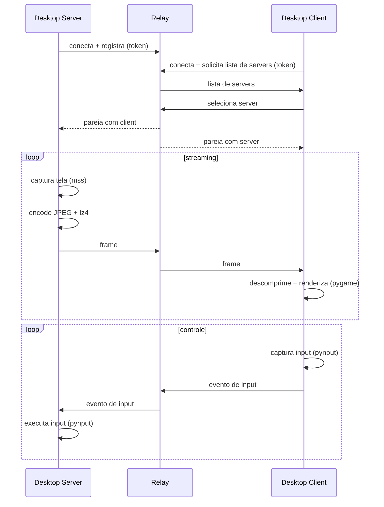

# remote-desk

Desktop remoto open-source para Windows que transmite tela e input por um relay WebSocket. Cliente e servidor conectam-se de forma outbound a um relay compartilhado, o que permite acesso atraves de NAT e pela internet sem abrir portas.

[](LICENSE) [](https://www.python.org)

O remote-desk tem tres componentes: um **server** desktop captura a tela e executa o input recebido, um **client** desktop exibe o stream e captura mouse/teclado locais, e um **relay** leve roteia o trafego entre eles. Este repositorio e um scaffold em estagio inicial: a estrutura de pastas, o layout de modulos, as dependencias e a arquitetura estao definidos, mas os modulos Python ainda sao arquivos esqueleto aguardando implementacao (ver [STATUS.md](STATUS.md)).

## Funcionalidades

- **Acesso remoto:** visualiza um desktop Windows remoto e controla seu mouse e teclado.
- **NAT traversal:** conectividade via relay, com client e server conectando outbound a um relay compartilhado.
- **Captura de tela:** via `mss`, sem necessidade de privilegios de administrador.
- **Encoding de frames:** JPEG com Pillow mais compressao adicional com `lz4`.
- **Renderizacao:** exibicao dos frames no client com `pygame`.
- **Input remoto:** captura e execucao de mouse/teclado com `pynput`.
- **System tray:** integracao na bandeja do sistema no server via `pystray`.
- **Autenticacao:** por token, validado no relay, com TLS previsto para producao.
- **Configuracao JSON:** via `desktop/config.example.json` (URL do relay, token, FPS de captura, qualidade, escala, monitor, hotkeys do client).
- **Build:** scripts PyInstaller para gerar executaveis standalone.

> Nota: os modulos estao estruturados mas ainda nao implementados. As funcionalidades acima descrevem o design documentado, refletido no layout de modulos, nas dependencias e em `docs/ARCHITECTURE.md`.

## Arquitetura

O sistema tem tres componentes. O **server** desktop roda na maquina controlada, o **client** desktop roda na maquina controladora, e o **relay** roteia mensagens entre eles por WebSocket.

```
[Client]  <--WebSocket-->  [Relay]  <--WebSocket-->  [Server]
```

Fluxo de uma sessao tipica (ver `docs/ARCHITECTURE.md`):



Concerns compartilhados ficam em `desktop/common/`: protocolo de wire (`protocol`), gerenciamento de conexao (`connection`), compressao (`compression`) e carregamento de config (`config`).

## Requisitos

- Python 3.10+
- Windows 10/11 para o client e o server desktop
- Uma VPS Linux (recomendado) para o relay

Dependencias desktop (`desktop/requirements.txt`): `websockets`, `mss`, `Pillow`, `pynput`, `lz4`, `pygame`, `pystray`, `pyinstaller`.

Dependencias do relay (`relay/requirements.txt`): `websockets`.

## Instalacao

```powershell
# Clonar o repositorio
git clone https://github.com/fabricioguidine/remote-desk.git
Set-Location remote-desk

# Criar e ativar um ambiente virtual
python -m venv venv
.\venv\Scripts\Activate.ps1

# Instalar dependencias desktop (client e server)
pip install -r desktop\requirements.txt
```

No host do relay (VPS Linux):

```bash
pip install -r relay/requirements.txt
```

Para configurar uma instalacao desktop, copie o exemplo de config e edite:

```powershell
Copy-Item desktop\config.example.json desktop\config.json
```

## Uso

Rodar o relay na VPS:

```bash
python -m relay.server
```

Rodar o server no PC Windows a ser controlado:

```powershell
python -m desktop.server.main
```

Rodar o client no PC Windows que controla:

```powershell
python -m desktop.client.main
```

## Build

Gerar executaveis standalone com PyInstaller:

```powershell
python scripts\build_server.py
python scripts\build_client.py
python scripts\build_relay.py
```

Os executaveis ficam em `dist/`.

## Documentacao

- [docs/ARCHITECTURE.md](docs/ARCHITECTURE.md) — arquitetura, protocolo de wire, seguranca e metas de performance.
- [docs/SETUP_VPS.md](docs/SETUP_VPS.md) — configuracao do relay em uma VPS Linux (TLS, DuckDNS, systemd).
- [docs/SETUP_ALTERNATIVES.md](docs/SETUP_ALTERNATIVES.md) — alternativas ao relay proprio (ngrok, bore, Cloudflare Tunnel, Tailscale).
- [docs/USAGE.md](docs/USAGE.md) — primeiro uso, controles e resolucao de problemas.

## Licenca

Distribuido sob a [Licenca MIT](LICENSE).
